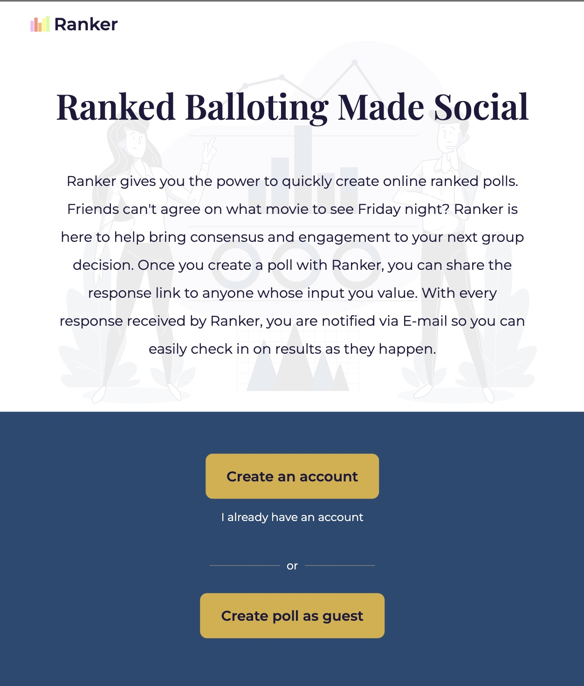
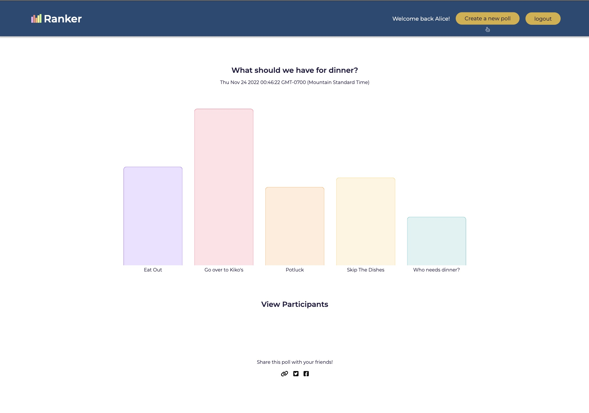
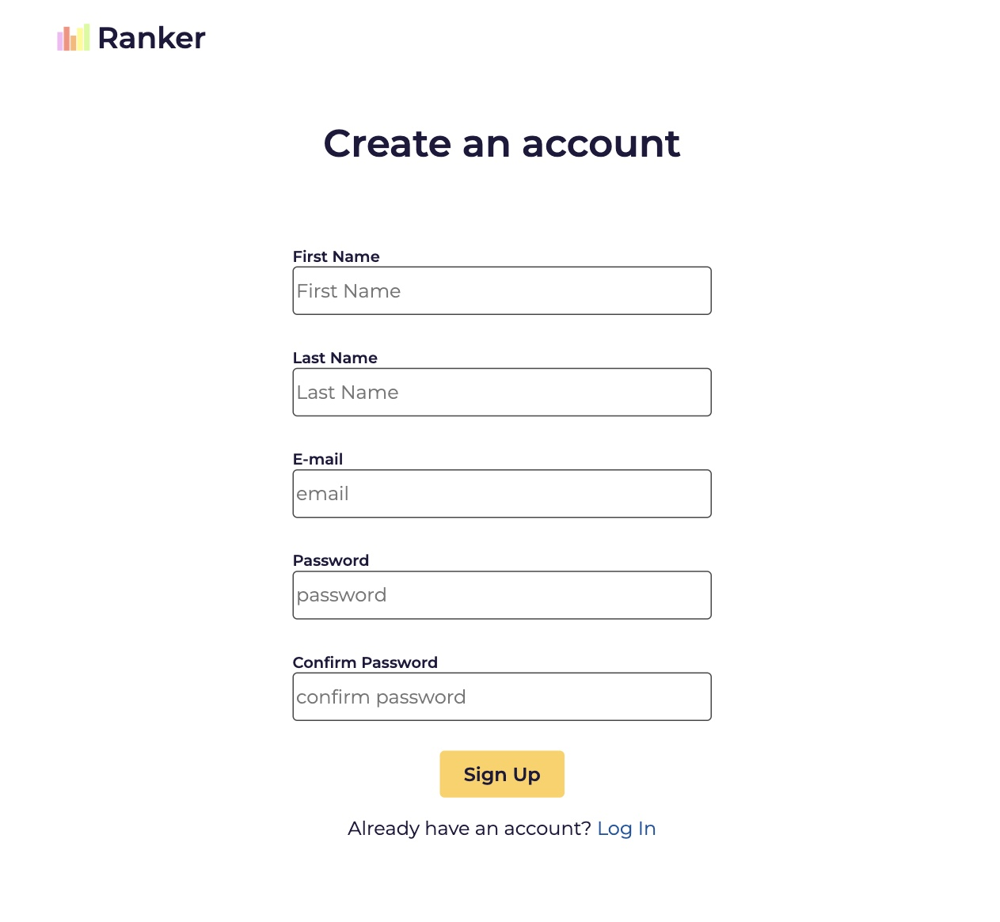
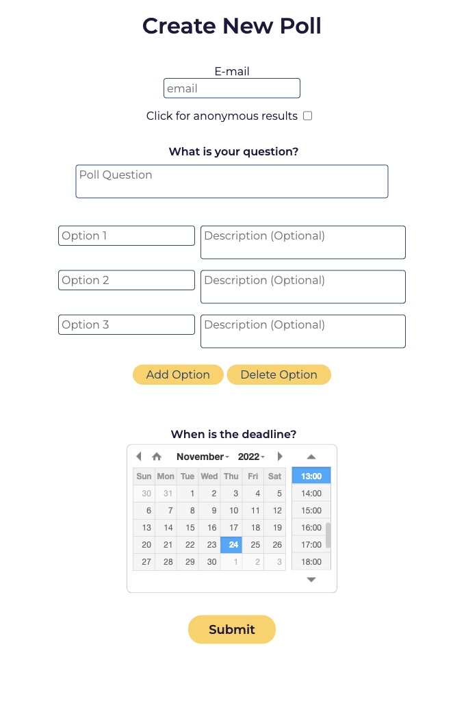
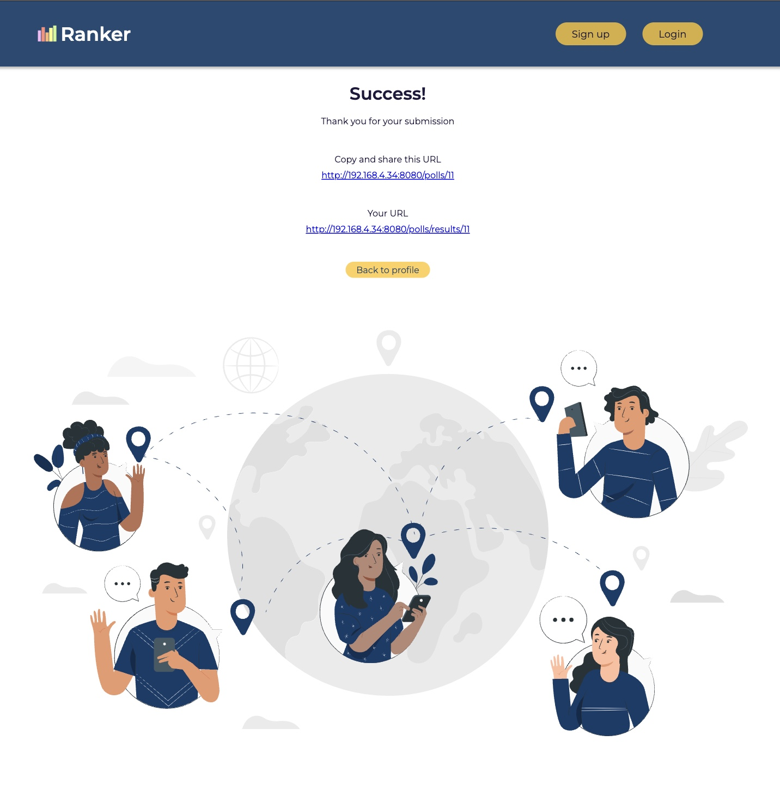
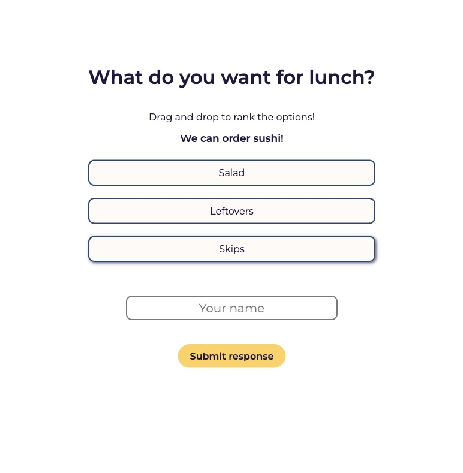
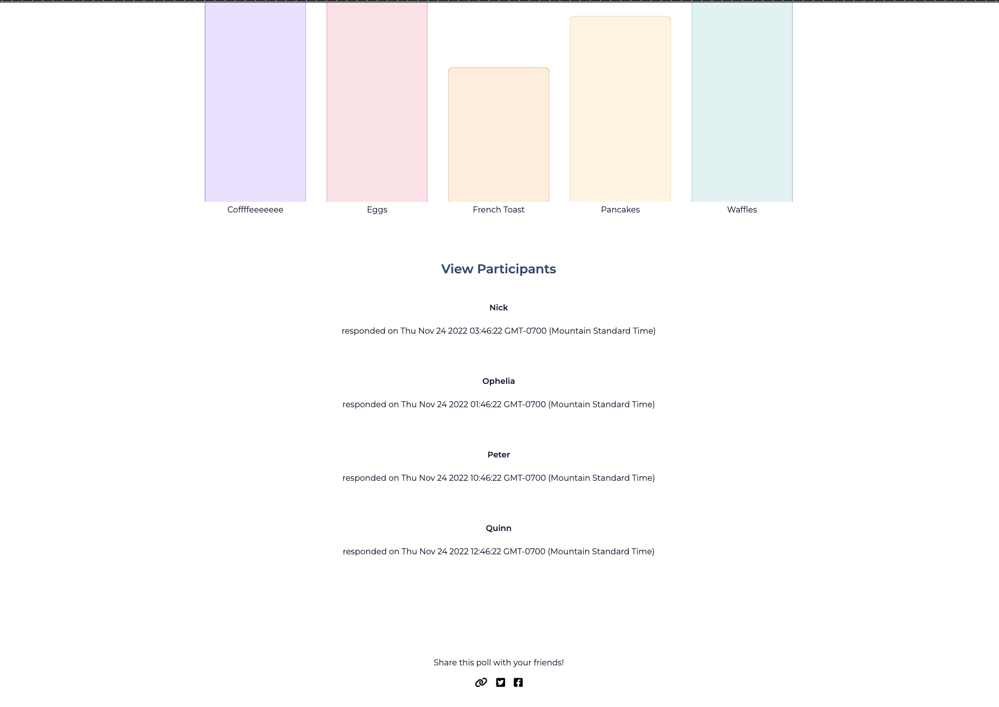

==================================================

Ranker is a web application that lets user create polls to be shared with their family, friends, or co-workers.

## Getting Started

 1. Install dependencies using the `npm install` command
 2. Start the web server by using the `npm run local` command. The app will be served at <http://localhost:8080>
 3. Visit <http://localhost:8080> in your browser to get started.

 
 

 ## Usage

 Users can create an account to begin which gives the user access to previously made polls:

 
 

or can continue as a guest. 

After creating the poll, the user will receive two URLs which can be shared for responses and another one for the result.

links can then be used to access the response page 

and the result page of the poll:

## Dependencies

- Node 10.x or above
- NPM 5.x or above
- PG 6.x or above
- Bcryptjs 2.4.3 or above
- Chalk 2.4.2 or above
- Dotenv 2.0.0 or above
- enj 2.6.2 or above
- mailgun-js 4.17.1 or above
- morgan 0.22.0 or above
- pg 8.5.0 or above
- sass 1.35.1 or above
- ip 1.1.8 or above

