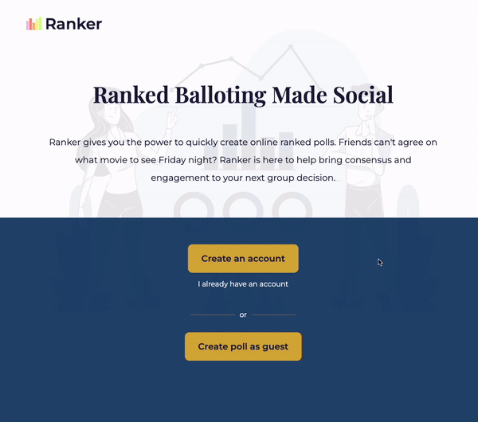
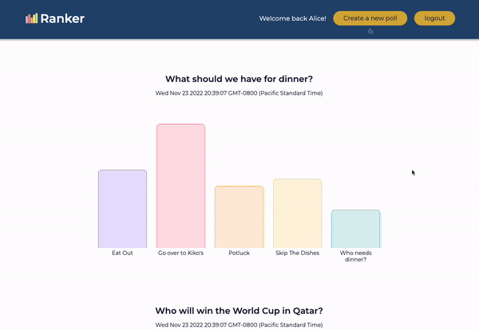
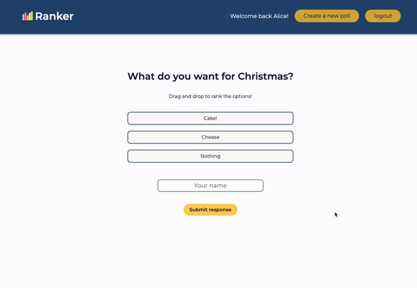

==================================================

Ranker is a web application that lets user create polls to be shared with their family, friends, or co-workers.

## Getting Started

 1. Install dependencies using the `npm install` command
 2. Start the web server by using the `npm run local` command. The app will be served at <http://localhost:8080>
 3. Visit <http://localhost:8080> in your browser to get started.
 4. Or simply visit <https://lighthouse-midterm-ranker.herokuapp.com/> - We've hosted our website on Heroku.

## Usage

 Users can create an account to begin which gives the user access to previously made polls, or can continue as a guest. 

After creating the poll, the user will receive two URLs which can be shared for responses and another one for the result.

Links can then be used to access the response page 
and the result page of the poll:

## Features

- Users can create a poll with up to 7 options (and descriptions) instantly with or without an account. Users can also make the poll anonymous.
- Polls can be shared to friends via Facebook or Twitter, or simply by sending the url to friends.
- People can then rank the options by dragging and dropping the options and submit the response.
- Users will receive an email whenever someone answers to your poll.
- If the user has an account, they can log in and see the results of all the polls they've created with Ranker.
- In the result page, users can see how many scores each option received, and who responded to the poll (if the poll is not anonymous).
- Share the result with friends on social media!

## Dependencies

- Node 10.x or above
- NPM 5.x or above
- PG 6.x or above
- Bcryptjs 2.4.3 or above
- Chalk 2.4.2 or above
- Dotenv 2.0.0 or above
- enj 2.6.2 or above
- mailgun-js 4.17.1 or above
- morgan 0.22.0 or above
- pg 8.5.0 or above
- sass 1.35.1 or above
- ip 1.1.8 or above

